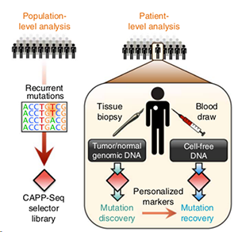

# Using Targeted Sequencing to Further Cancer Diagnostics
1. [Introduction](#1) 
2. [Overivew of Methods](#2) 
3. [Overview of Tools](#3) 
	a. [Whole Genome Sequencing](#31) 
	b. [Whole Exome Sequencing](#32) 
	c. [CAPP-Seq](#33) 
	d. [TAm-Seq](#34) 
4. [Applications & Future Use](#4) 
5. [Data Tables & Figures](#5) 

## Introduction

The field of cancer diagnostics has experienced tremendous growth and technical developments over the past decade. The advent of high throughoupt sequencing technologies coupled with high-specificity screening methods is enabling the discovery of new biomarkers and potential early disease diagnosis of patients. [1] With early diagnosis comes a variety of benefits for the patient including increased treatment options and higher overall survival rate. For colon cancer ,there is a 91% 5-year survival rate when diagnosed early versus only 11% survival rate if it is caught late and has spread to other organs. [2] Unfortunately, current diagnosis options such as tissue biopsies, endoscopy, or radiology are often invasive to patients. In addition, tissue biopsies only provide a snapshot of the mutations in a patient.

In this chapter, we will be introducing the use of sequencing technologies to analyze liquid biopsy based cancer samples. Early studies in 1977 revealed a high level of cell free DNA and circulating tumor DNA in cancer patient plasma. Liquid biopsy based diagnostics how to solve the invasive and costly drawbacks of tissue biopsy while serving as a highly specific predictor of cancer. Liquid biopsy aims to detect cancer mutations within the plasma, provide early screening options for these mutations, and monitor these mutations over time to assess tumor burden and treatment effectiveness.

Liquid Biopsy Overview: https://www.ncbi.nlm.nih.gov/pubmed/29747380

## Overivew of Methods

#### Whole Genome Sequencing (WGS): 

#### Whole Exome Sequencing (WES) :

CAPP-Seq Workflow:  
 
[Figure 1](https://www.ncbi.nlm.nih.gov/pmc/articles/PMC4016134/figure/F1/). 
** Insert CAPP-Seq Image Description**

#### CAPP-Seq:
Cancer Personalized Profiling by Deep Sequencing (CAPP-Seq) is a highly sensititve and economical method to quantify ctDNA. In general, ctDNA levels are highly correlated with tumor volume and can provide earlier treatment response assessment compared to radiographic approaches. In non-small cell lung cancer patients, ctDNA was detected in 100% of stage II-IV tumors and 50% of stage I tumors. The CAPP-Seq technique requires designing a "selector" of biotinylated DNA oligonucleotides that target recurrently mutated regions in the cancer of interest. The selector panel is often optimized using WES data and other intron breakpoints to best span the mutated areas. CAPP-Seq can be further applied to disease stage monitoring as it can predict tumor stage progression via ctDNA analysis with a relatively high degree of sensitivity and specificity. 

Experimentally, it is possible to use CAPP-Seq across different time points to understand how the allele frequencies of different mutations are changing in response to treatment. This approach requires analyzing both ctDNA and germline DNA as a baseline to compare the variants. Mutations that tend to increase in frequency may be experiencing selective pressure and targeting these mutations can signficantly reduce disease progression. 
https://www.ncbi.nlm.nih.gov/pmc/articles/PMC4016134/

TAm-Seq Workflow:

[Figure1](https://www.ncbi.nlm.nih.gov/pmc/articles/PMC4016134/figure/F1/). Figure Description**Figure Citation**

#### TAm-Seq:
Plasma of cancer patients contains cell-free tumor DNA that carries information on tumor mutations and tumor burden. Individual mutations have been probed using allele-specific assays, but sequencing of entire genes to detect cancer mutations in circulating DNA has not been demonstrated. We developed a method for tagged-amplicon deep sequencing (TAm-Seq) and screened 5995 genomic bases for low-frequency mutations. Using this method, we identified cancer mutations present in circulating DNA at allele frequencies as low as 2%, with sensitivity and specificity of >97%. We identified mutations throughout the tumor suppressor gene TP53 in circulating DNA from 46 plasma samples of advanced ovarian cancer patients. We demonstrated use of TAm-Seq to noninvasively identify the origin of metastatic relapse in a patient with multiple primary tumors. In another case, we identified in plasma an EGFR mutation not found in an initial ovarian biopsy. We further used TAm-Seq to monitor tumor dynamics, and tracked 10 concomitant mutations in plasma of a metastatic breast cancer patient over 16 months. This low-cost, high-throughput method could facilitate analysis of circulating DNA as a noninvasive “liquid biopsy” for personalized cancer genomics.

Here, we demonstrate noninvasive identification of mutant alleles in plasma, at AFs as low as 2%, by targeted deep sequencing of circulating DNA. Our TAm-Seq method uses a combination of short amplicons, two-step amplification, sample barcodes, and high-throughput PCR. Because the amplicons are short, this method effectively amplifies even small amounts of fragmented DNA such as are present in circulating DNA. The two-step amplification permits extensive primer multiplexing that enables the amplification and sequencing of sizeable genomic regions by tiling short amplicons without loss of fidelity or efficiency. Duplicate sequencing of each sample is used to avoid false positives stemming from PCR errors. Sample barcodes and high-throughput PCR reduce the per-sample costs to a range where this may be widely applicable. Preparing TAm-Seq libraries for sequencing from 48 samples takes less than 24 hours and involves only few hours of hands-on time. New platforms for massively parallel sequencing allow for fast turnaround times, which make this approach practical in a clinical setting.

We therefore applied TAm-Seq as a generic tool to measure changes in the frequency of ctDNA over time. We studied serial plasma samples collected during follow-up and treatment of two patients with relapsed HGSOC, collected during 104 and 273 days of follow-up and treatment, respectively. Frequencies of mutant TP53 alleles were measured by TAm-Seq and in parallel by digital PCR using a mutation-specific probe. The two methods of quantification had excellent agreement. Mutant AFs in plasma of ovarian cancer patients reflected well the clinical course of the disease compared to the serum marker CA125, showed marked decrease when systemic treatment was initiated, and increased in parallel to disease progression.

Prototypic example where the AF's of 10 different mutations in a patient with metastatic breast cancer all sharply decline upon onset of the chemotherapy, but increase after termination of the therapy. By monitoring the AF of common mutations amongst patients with different disease subsets, it may be possible to generate more personalized treatment options.

https://www.ncbi.nlm.nih.gov/pubmed/22649089

## Future Applications &  

## Industry Overview  
The cancer diagnostics industry is expected to reach a net worth of approximately 232.7 billion USD by 2025. The market of individuals who could benefit from more accurate diagnostics increases annually as the National Cancer Institute estimates approximately 14 million new cases a year. There are a variety of companies developing technologies to further cancer diagnostics. GRAIL uses high through-put sequencing to understand cancer causing mutations while Freenome uses machine learning to predict immune response that are results of cancer development. 

## Data Tables & Figures  
<table>
 <tbody>
    <tr>
        <th>Attribute / Parameter </td>
        <th>Whole Genome Sequencing (WGS) </td>
        <th>Whole Exome Sequencing (WES)</td>
        <th>Targeted Sequencing</td>
    </tr>
    <tr>
        <td> Information Level </td>
        <td> Everything </td>
        <td> Genes </td>
        <td> User Defined </td>
    </tr>
    <tr>
        <td> Cost Per Sample </td>
        <td> $5000 </td>
        <td> $2000 </td>
        <td> $200 </td>
    </tr>
    <tr>
        <td> Low Frequency Mutation Detection </td>
        <td> Not Possible </td>
        <td> Not Likely </td>
        <td> Yes </td>
    </tr>
    <tr>
        <td> DNA Input Amount </td>
        <td> 1 ug </td>
        <td> 100 - 200 ng </td>
        <td> 10 ng </td>
    </tr>
    <tr>
        <td> # of Samples in Parallel </td>
        <td> 1 </td>
        <td> 2 </td>
        <td> 96 </td>
    </tr>
 </tbody>
</table>

## References  
[1] “Biomarkers.” Canary Foundation, www.canaryfoundation.org/canary-science/science/biomarkers/.  

[2] “Understanding Statistics Used to Guide Prognosis and Evaluate Treatment.” Cancer.Net, 11 Aug. 2018, www.cancer.net/navigating-cancer-care/cancer-basics/understanding-statistics-used-guide-prognosis-and-evaluate-treatment. 

[3] 

